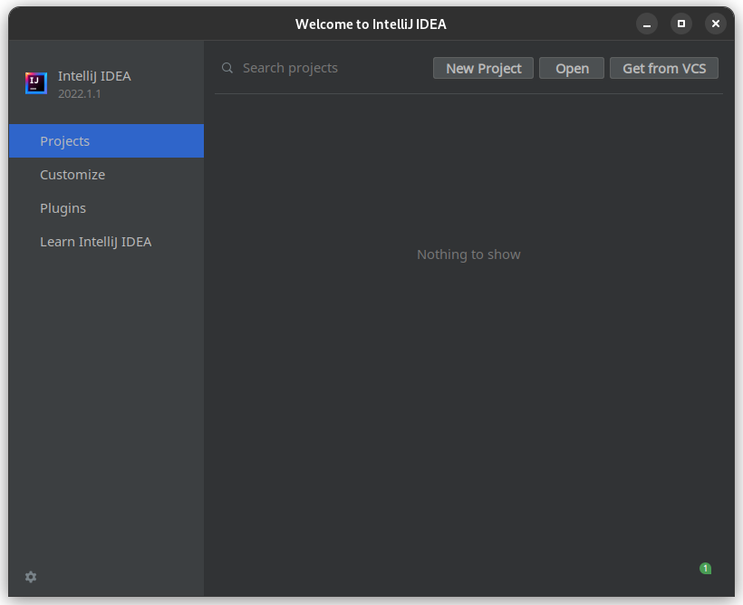
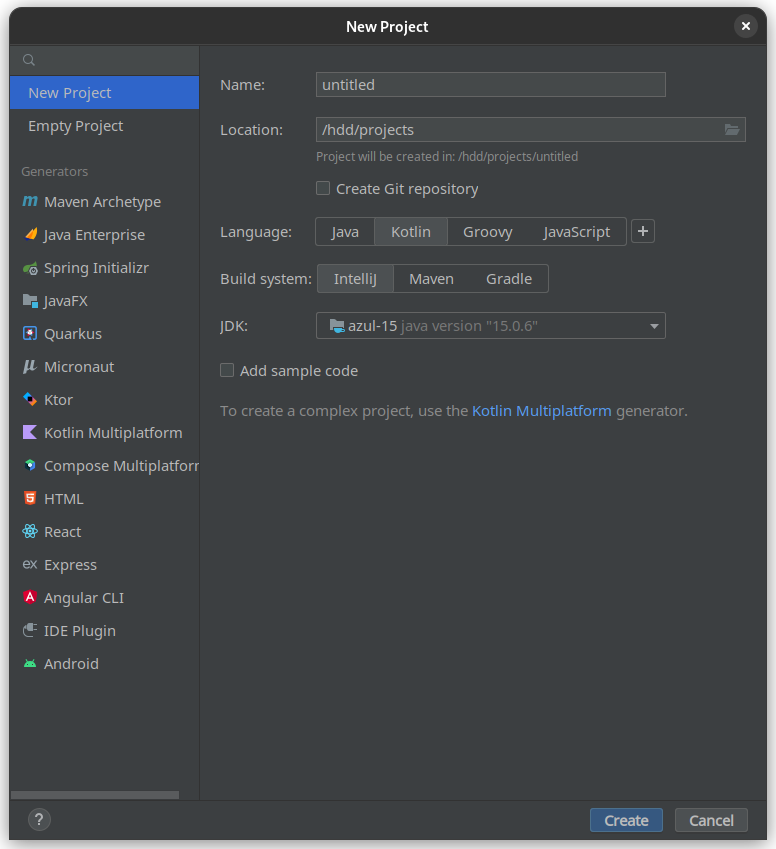
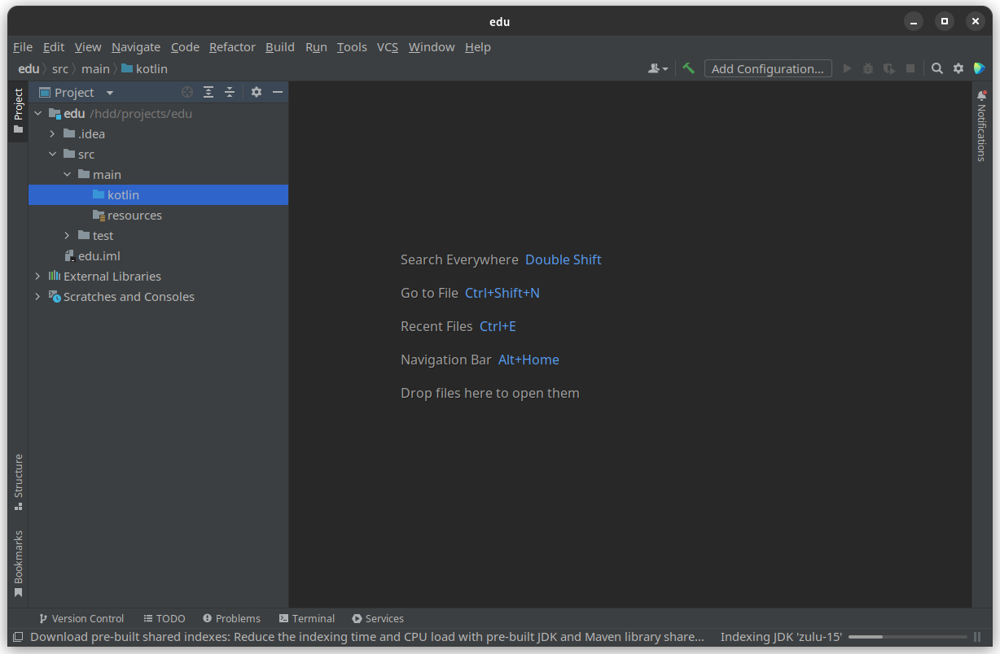

# Середовище розробки
Для початку, розберімось з місцем, де будемо писати код та його запускати. 
Зазвичай при роботі з Котліном використовують Intellij Idea, тому візьмім її.

## Як встановити
Intellij Idea поділяється на дві версії: **Community Edition** (безкоштовна версія) і **Ultimate Edition** (версія з передплатою).

Вибирайте те, що підходить саме вам, але, якщо чесно, для новачків різниці немає.
:::tip Корисно знати
Якщо ви студент, ви можете отримати Ultimate Edition **безкоштовно** заповнивши 
[цю форму](https://www.jetbrains.com/shop/eform/students).
:::

Завантажити можна зі спеціальної утиліти ([Jetbrains Toolbox](https://www.jetbrains.com/ru-ru/toolbox-app/)) або завантажити напряму [тут](https://www.jetbrains.com/ru-ru/idea/download/#section=linux).
Далі встановлюйте налаштування, що підходять саме вам (тему та ін.).
## Створення проєкту
Нумо створимо наш проєкт:

Натискаємо на «New Project» при створенні проєкту:

Називати проєкт можна як завгодно, але тільки латиницею.

Мова, звичайно, Kotlin, а Build система Intellij (поки не будемо розглядати, що це).

Натискаємо «Create» та створюємо проєкт.
В новому віконці з'явиться наш проєкт зі стандартною структурою.

Весь ваш котлін код має знаходитись в теці «src/main/kotlin».
Поки можете створити файл «Main.kt», щоб пізніше там програмувати.

Для того, щоб створити файл, клацніть правою кнопкою миші на теку «kotlin» -> «New» -> «Kotlin File» та впишіть «Main».