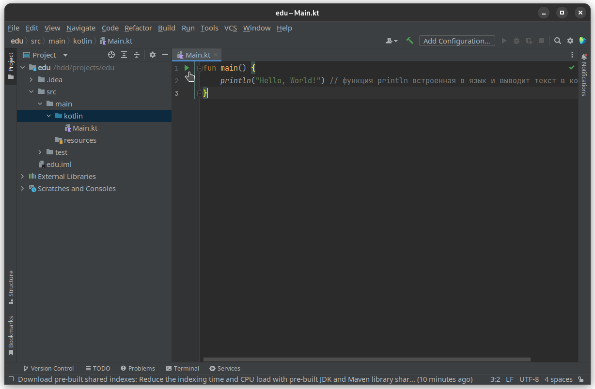
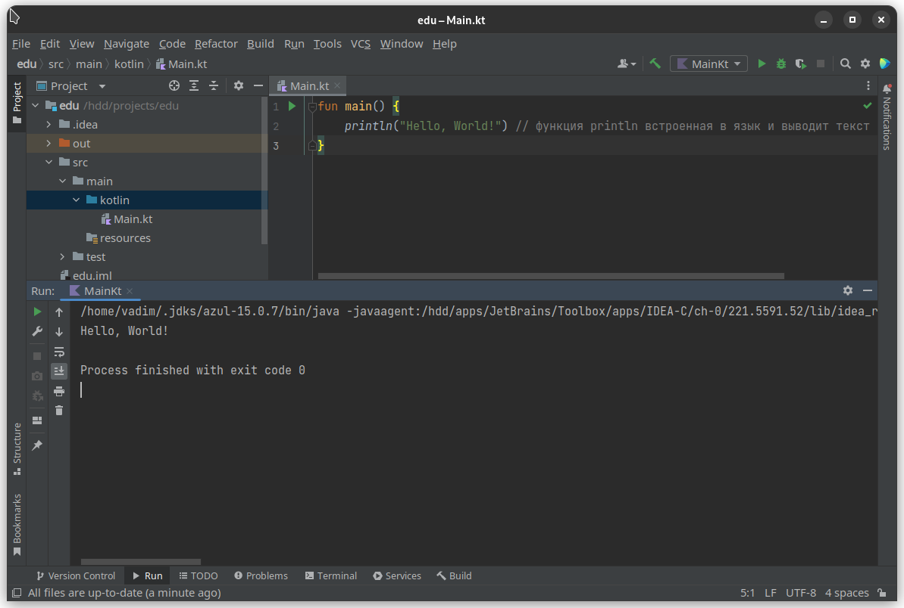

# Functions
Think of any single action or multiple actions that you do every day and give it a name. Let's take running as an example of such a set of actions.

Running is a similar kicking action that depends on some variables (for example, your fitness, pace, or fatigue).
All such actions in the world of programming are called *functions*.
What is a function? A **Function** is a piece of code that has a unique name, type, and is the result of executing a function
(aka value or magnitude) and/or parameters (the same variables on which an action of the same type depends).
* A code snippet is the same actions you do, for example, while running. Separating some code to a function does only one thing: get rid of the same code.
* Function parameters are values that your piece of code depends on. For example, numbers on which some function calculations will be performed. Parameters cannot be changed (they cannot be assigned a different value).
* The resulting type is what you get as a result of your action. For example, you get the amount of time you ran, and that is the result (it called the *result of a function (its type)* in programming).
  You can write the function like this:
```kotlin
fun [Function name]([Parameter name]: [Parameter type]): [Result type] {
...
}
```
Don't be intimidated by the amount of text here! In fact, everything is very simple:
- The `fun` keyword is used to declare (create) a new function.
- Next we have the name of the function, which has the same rules as the names of variables - a unique name without spaces, the first character is small, and so on.
- Next, round brackets are opened, where the parameters of the function are specified. Even if the parameters of the function are not needed, they are still specified.
  * Next comes the name of the argument, where the same rules apply as for the name of functions and variables
  * This is followed by a mandatory indication of the type (essence) of our argument.
  * If we have several arguments, it is followed by `,` and the indication of the next argument.
  * Well, we close the parentheses
* This is followed by an indication of the type resulting from the calculation of the function. But it is worth considering that functions do not always have to return something (if a function does not return anything, it should have `Unit` return type).
* Next, the curly braces (everything inside called the **body of the function**) are opened, where our code fragment already goes. If we need to return something from a function, the `return` keyword is used (for example, to return an integer we write `return 10`).
  Now that we have seen the formulas for our programs, let's move on to the combat task!
## Example
To consolidate our knowledge, let's try to do something.
In each course, everyone first does 'Hello, World'. Let's not change the traditions.
In order to create a program, it is logical that we need to define its starting point. In Kotlin, the starting point is declared by creating the `main()` function (which, by the way, does not return any result).
```kotlin
fun main(): Unit {
    println("Hello, World!") // the println function is built into Kotlin
}
```
In order to run our program, in the IDE we press the following button:



And in the drop-down list, click 'Run Main.kt'.
And we get the result:



By the way, the Unit type is default for all functions, so it is not necessary to specify it.

Let's move on to more complex tasks.

I don't like to touch math when explaining some topics, but let's try to create a function by
programming language tools.
Let's take the following easy-to-understand expression:
:::info Task
Reproduce the following expression using the programming language:
$$
f(x)=x+1
$$
:::
:::tip Need to know
If you remember the school course of mathematics, then you could already remember about the coordinate axis.
In our case, we have `x` (the independent variable) and `y` (which is dependent on `x`).

That is, `y` is what is returned as a result of the execution of the function (equivalent to `return`).
But, of course, we will not draw graphs, we have a completely different task.
:::
We have some function with a parameter `x` (a number, obviously) that returns the specified number plus one.
What would a similar function look like in Kotlin?
```kotlin
fun f(x: Int): Int {
    return x + 1
}
```
Seems not hard, right? The main thing, first, is to look at the formula of how the function declares.
Let's call this function:
```kotlin
fun main() { // declare the beginning of our program
    val x: Int = 10 // set an arbitrary number
    val result: Int = f(x) // we get the result from the execution of the function
    println(result) // println is a built-in Kotlin function that writes text to the console. We have the text (result) from the execution of the function in the variable.
}
```
By the way, it can be simplified to the following option:
```kotlin
fun f(x: Int) = x + 1
```
Code that has only one sequence of actions can be declared with `=`. The return type will be determined automatically
by the programming language. In our case, it will be `Int`, that is, an integer.
Also, «Hello, World!» we could write in the following way:
```kotlin
fun main() = println("Hello, World!")
```

But most often, your code will be longer than one sequence of actions.

By the way, this also works with variables:
```kotlin
fun main() {
    val x = 10 // no need to specify type, it automatically parsed by compiler
    val result = f(x) // no need to specify type, it automatically parsed by compiler
    println(f(x))
}
```
It is necessary to consolidate knowledge with practice! To do this, try writing a small program to solve the following function:

$f(y)=\frac{y}{2}$

It is also worth noting that division is performed using the `/` operator.
And again an unfamiliar term! Who is this operator you mentioned?