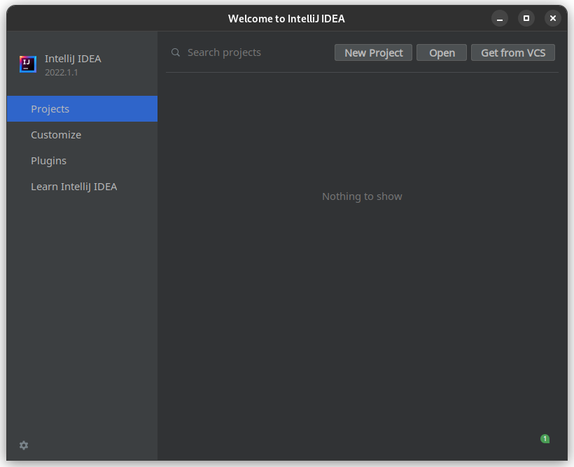
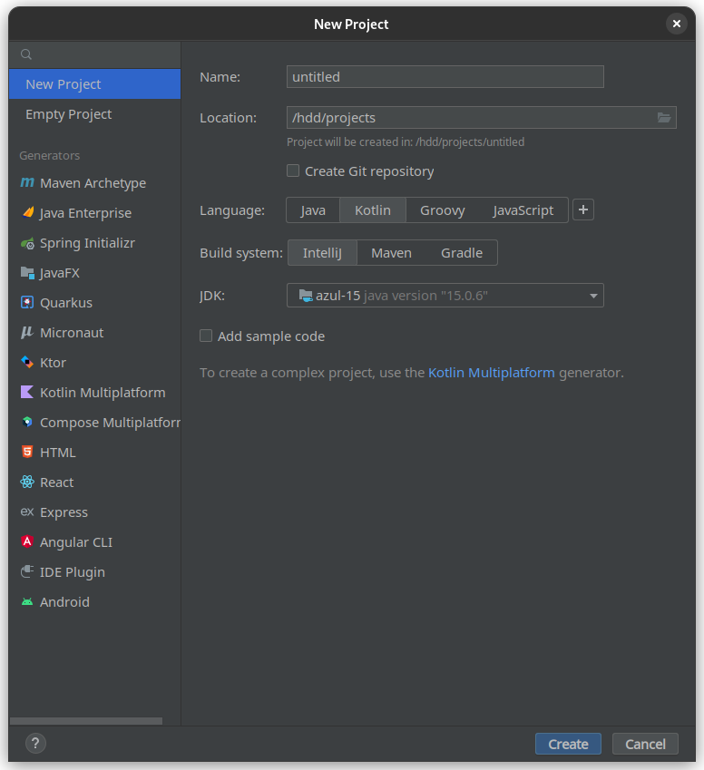
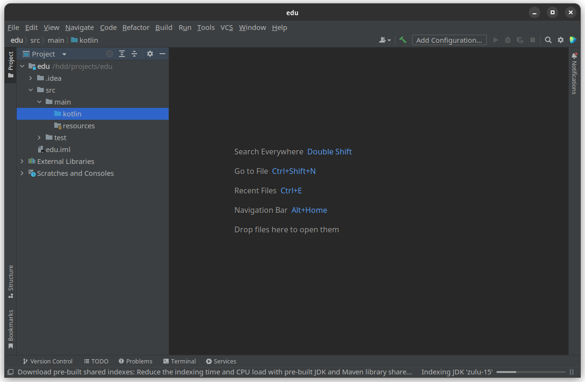

# Development environment
To begin with, let's deal with the place where we will write the code and run it.
Usually, when working with Kotlin, Intellij Idea is used, so let's take it.

## How to install
Intellij Idea is divided into two versions: **Community Edition** (free version) and **Ultimate Edition** (subscription version).

Choose what suits more for you, but to be honest, there is no difference for beginners.
:::tip Good to know
If you're a student, you can get the Ultimate Edition **for free** by filling out
[this form](https://www.jetbrains.com/shop/eform/students).
:::

You can download from a special utility ([Jetbrains Toolbox](https://www.jetbrains.com/ru-ru/toolbox-app/)) or download directly [here](https://www.jetbrains.com/idea/download/).
Next, set the settings that suit you (theme, etc.).
## Project creation
Let's create our project:

Click on "New Project" to create a project:

You can name the project anything you want, but only in Latin.

The language, of course, is Kotlin, and the Build system is Intellij (until we consider what it is).

Click "Create" and create a project.
Our project with a standard structure will appear in a new window.

All your Kotlin code should be in the "src/main/kotlin" folder.
For now, you can create a "Main.kt" file to write code there later.

To create a file, right-click on the "kotlin" folder -> "New" -> "Kotlin File" and type "Main".